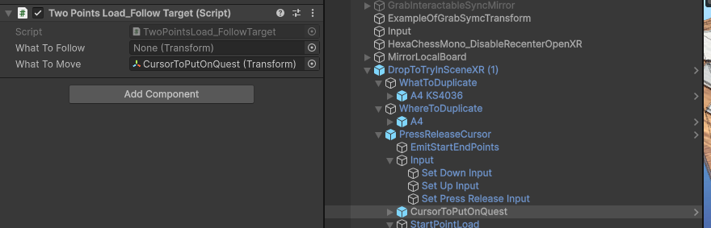
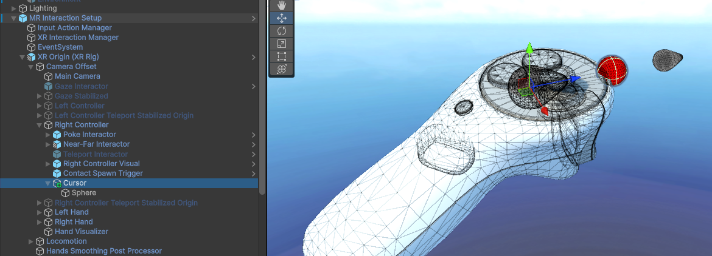
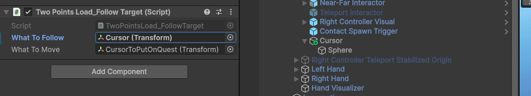
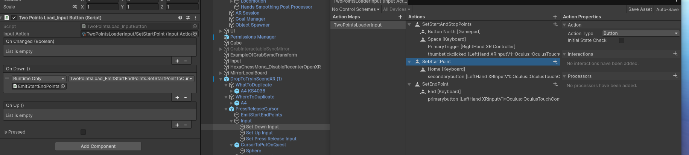
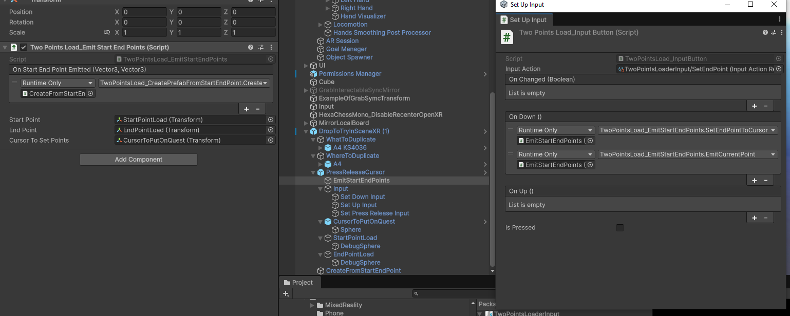
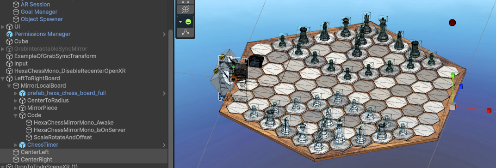
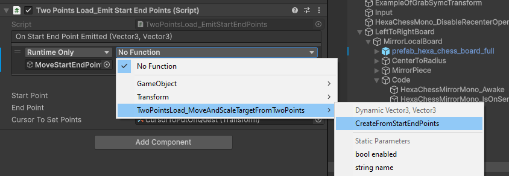
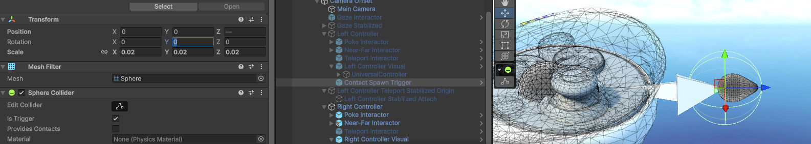
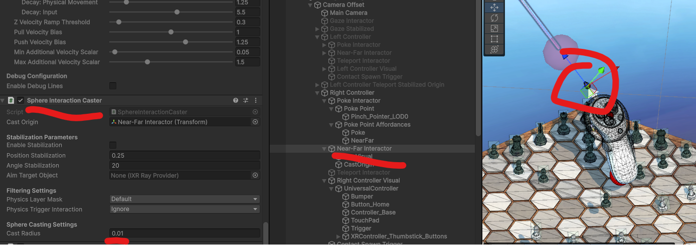

J ai pris le temps de faire un code pour synchroniser des points baser sur leur localisation par rapport au plateau de jeu.

Je ne m occupe pas du scale et par du principe que scaler le parent scale les enfants partout de la meme maniere.

Le scale c est un enfer.

Avec ce code que j ai tester en 2D avec la version Hexa Chess Phone.

Unity Code: https://github.com/EloiStree/2026_06_24_unity_hexa_chess_mirror_phone
APK : https://github.com/EloiStree/2026_06_24_unity_hexa_chess_mirror_phone/releases/tag/2026.7.13


Essayons de faire une version en AR que lon peu placer sur le vrai monde.


------------

Deja il nous faut un outil qui comme vu precedemment permet de mettre deux points de calibration a partir d un curseur.



Utilisons donc un script pour suivre la main XR du joueur.

Comme notre manettre en en Open XR et non en Meta.
Il faudra un jour creer un system pour calibrer precisement ce point.
En attendant, je vais le mettre a lavant et perdre 2-4 cm de precision.





Creeons des scripts pour ecouter aux inputs de "calibration"


Quand le deuxieme point est relacher, on le donner a l outil de replacement
Et on lui demande d emettre deux vectors pour le script qui lui sait comment replacer


On pourrait `spawn` le plateau. Mais c est plus simple si il est deja la et que on ne fait que le replacer et le scaler.

Il vas donc nous falloir creer un script.


``` cs
using UnityEngine;
using UnityEngine.Events;

namespace Eloi.TwoPointsLoader
{
    public class TwoPointsLoad_MoveAndScaleTargetFromTwoPoints : MonoBehaviour
    {

        [SerializeField]
        private UnityEvent m_onMovedObject;
        [SerializeField] private Transform m_targetToMoveAndScale;

        [SerializeField] private float m_scaleFactor = 1.0f;


        public void MoveWithStartEndPoints(Vector3 worldPointStart, Vector3 worldPointEnd)
        {
   
            Vector3 start = worldPointStart;
            Vector3 end = worldPointEnd;
            //bool isUpFlat = e.y > 0.05f;
            Vector3 endFlat = end;
            endFlat.y = start.y;
            float distanceStartEndFlat = (endFlat - start).magnitude;
            var toMove = m_targetToMoveAndScale;
            toMove.position = Vector3.zero;
            toMove.rotation = Quaternion.identity;
            Vector3 unityForward = Vector3.forward;
            Vector3 startEndDirection = endFlat - start;
            float rotationToApply = Vector3.SignedAngle(unityForward, startEndDirection, Vector3.up) - 90f;
            toMove.Rotate(Vector3.up, rotationToApply);
            Vector3 directionStart = worldPointStart;
            toMove.position = directionStart;
            toMove.localScale = Vector3.one * distanceStartEndFlat * m_scaleFactor;
            m_onMovedObject.Invoke();
        }
    }
}

```


Creatons un points vide avec un point a gauche et un point a droite a un de distance sur les X.
Et scalons le jeu pour faire un taille de un par rapport a cela.



Apppelons notre script



---------

...


-------




Ne pas oublier de dimensionner et positioner les scripts pour attraper les objets
