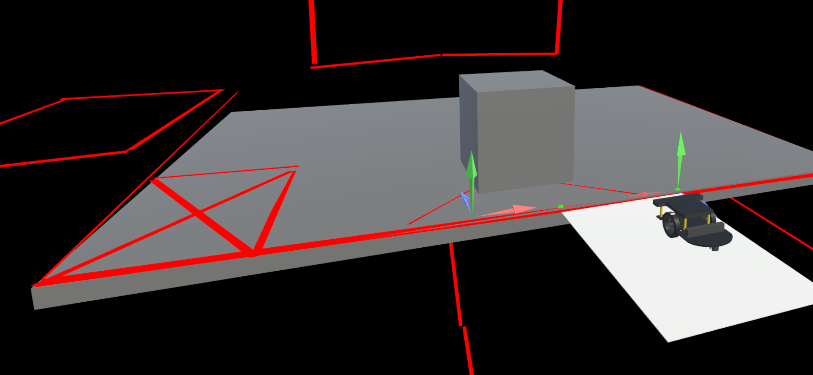

For this part to work you need to create a local to the board `NetworkTransform`.

With a boolean for size.

You need to sync


- https://github.com/EloiStree/2026_06_07_upm_load_prefab_from_two_points  
  - Exercice: https://www.youtube.com/watch?v=JzbzqD78Xyg&t=18s
  - Solution: https://youtu.be/5VOHJKlRwCE?t=28


**Add to your project:**
```
git submodule add https://github.com/EloiStree/2026_06_07_upm_load_prefab_from_two_points.git Packages/be.elab.twopointsloader
```