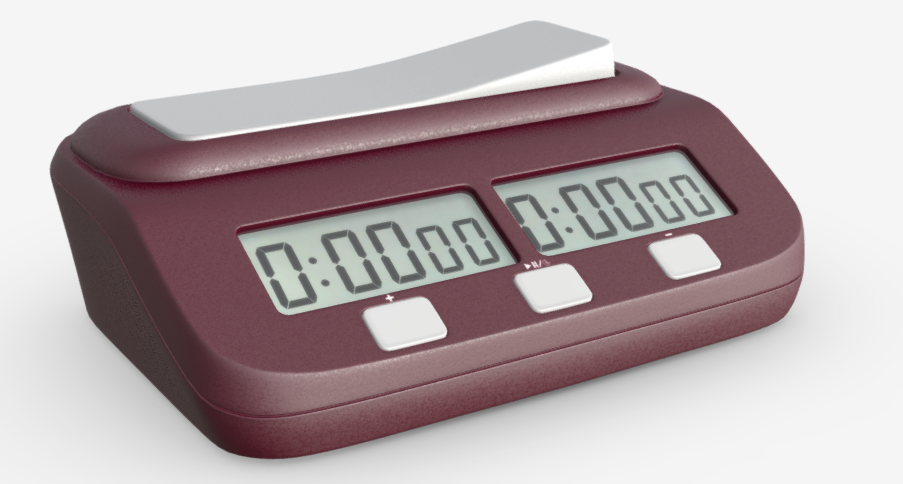
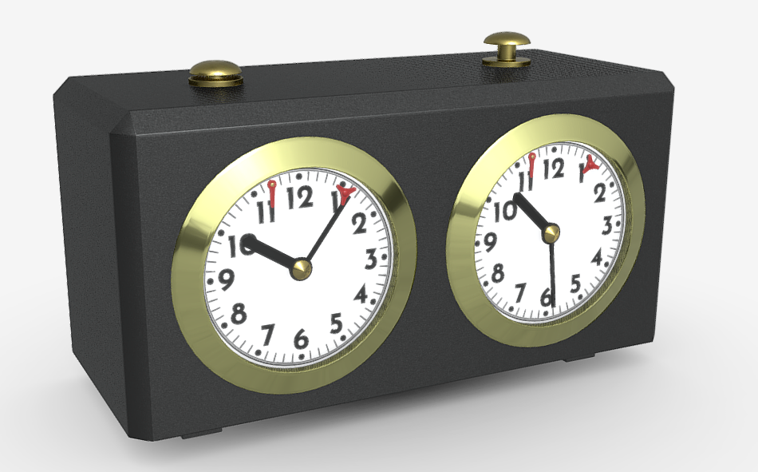
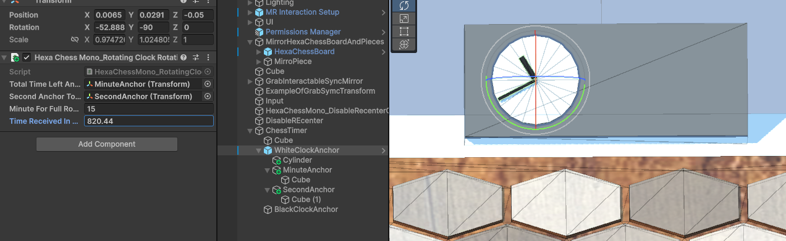
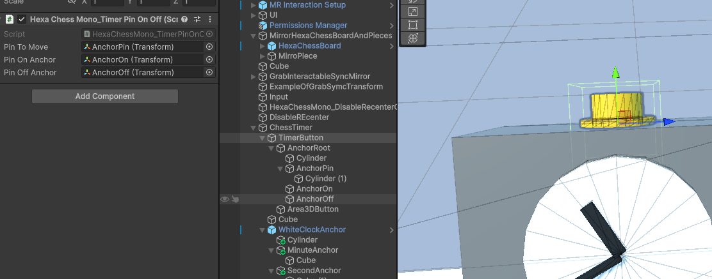
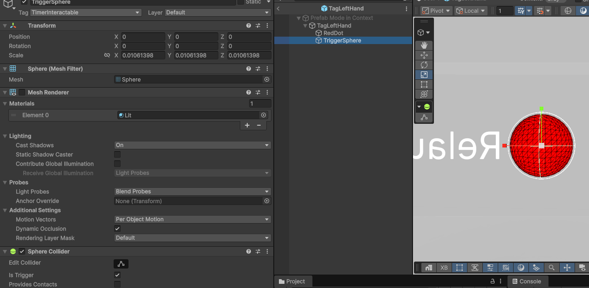
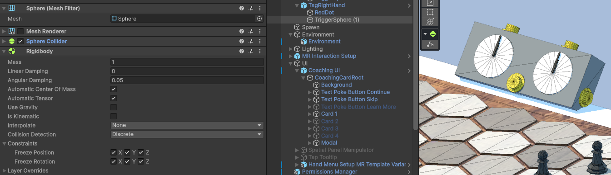
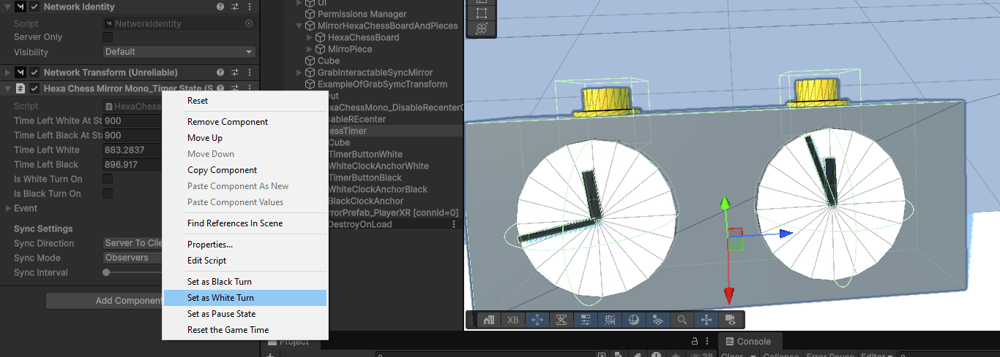
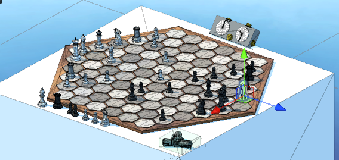

Ok want to create a chess game.
One part is how to move the piece and how to see player in.

The other is having a timer.


-----------

```
🔹 Execution control attributes (where a method is allowed to run)
[Server] → only runs on server, warns if called on client
[ServerCallback] → only runs on server, no warning if client calls it
[Client] → only runs on client, warns if called on server
[ClientCallback] → only runs on client, no warning if server calls it

🔹 Networking synchronization attributes (how data & calls travel between server/clients)

[Command] → client → server call
[ClientRpc] → server → all clients call
[TargetRpc] → server → one client call
[SyncVar] → variable auto-syncs from server → clients
[SyncObject] → collection auto-syncs from server → clients
```

[More information](https://github.com/EloiStree/2024_06_01_unity_hello_mirror_drone_soccer/blob/main/README.md)    


Ce que lon veut cest un timer avec deux compteur.
Et un enumerateur white wait black.

il nous faut donc un NetworkIdentity et un script qui herite de NetworkMono.
Il possedera deux booleans et deux timer avec un syncvar sur chaque.

Le `[SyncVar]` est un attribue qui permet de changer la donner sur le server et de la syncrhoniser chez les clients.

Ils nous faudra donc des appelles client qui demande des choses au servers.
C est ce que l on va faire avec les `[Command]`

Des Unity Event permettrons de mettre a jour le visuel.



https://sketchfab.com/3d-models/chess-digital-timer-game-clock-4b0d351d0ddc492db2bb4090d4d4f263   


   
https://sketchfab.com/3d-models/chess-analog-timer-game-clock-cac9854daabc4126ac585417e6c0edb9    


Comme on veut pas avoir un dependance avec TextMeshPro
On va partir sur un timer a aiguille

Il nous faut donc deux anchres a faire tourner sur l axe Y local.
Ce code n a pas besoin d etre en reseau.



```cs
using UnityEngine;

public class HexaChessMono_RotatingClockRotation : MonoBehaviour
{

    public Transform m_totalTimeLeftAnchorToRotate;
    public Transform m_secondAnchorToRotate;

    public float m_minuteForFullRotation = 15f;

    public float m_timeReceivedInSeconds = 0f;

    private void OnValidate()
    {
        UpdateCurrentTime(m_timeReceivedInSeconds);
    }

    public void UpdateCurrentTime(float time)
    {
        m_timeReceivedInSeconds = time;
        RefreshClock();
    }

    public void RefreshClock()
    {
        float timeReceived = m_timeReceivedInSeconds;
        float seconds = timeReceived % 60f;
        float totalMinutesPercentage = (m_timeReceivedInSeconds / (m_minuteForFullRotation * 60f));
        float percentageOfSecond = seconds / 60f;

        if (m_secondAnchorToRotate)
            m_secondAnchorToRotate.localEulerAngles = new Vector3(0f, percentageOfSecond * 360f, 0f);
        if (m_totalTimeLeftAnchorToRotate)
            m_totalTimeLeftAnchorToRotate.localEulerAngles = new Vector3(0f, totalMinutesPercentage  * 360f, 0f);
    }
}
```


Il nous faudra aussi un animaiton pour le boutton.
En attendant, utilisons deux anchres

We nee a button to display if the timer is on or off.
And a temporary trigger to test it with any collision found.

```cs
public class HexaChessMono_TimerPinOnOff : MonoBehaviour {

    public Transform m_pinToMove;
    public Transform m_pinOnAnchor;
    public Transform m_pinOffAnchor;

    public void SetPinOnOffState(bool pinIsOn) {

        if (pinIsOn)
        {
            m_pinToMove.position = m_pinOnAnchor.position;
            m_pinToMove.rotation = m_pinOnAnchor.rotation;
        }
        else
        {
            m_pinToMove.position = m_pinOffAnchor.position;
            m_pinToMove.rotation = m_pinOffAnchor.rotation;
        }
    }
    [ContextMenu("Set Pin On")]
    public void SetPinOn()
    {
        SetPinOnOffState(true);
    }
    [ContextMenu("Set Pin Off")]
    public void SetPinOff()
    {
        SetPinOnOffState(false);
    }
}
```

You can add layer, tag name or script tag collision detection if you want more clean code.


```cs
using UnityEngine;
using UnityEngine.Events;

public class HexaChessMono_AnyCollisionEnterToUnityEvent : MonoBehaviour
{
    public UnityEvent m_onCollisionEnterEvent;

    public bool m_useCollisionEnter=true;
    public bool m_useTriggerEnter;


    private void OnCollisionEnter(Collision collision)
    {
        if (m_useCollisionEnter)    
            m_onCollisionEnterEvent.Invoke();
    }

    private void OnTriggerEnter(Collider other)
    {
        if (m_useTriggerEnter)  
            m_onCollisionEnterEvent.Invoke();
    }
}
```



Using Tag
```cs
using UnityEngine;
using UnityEngine.Events;

public class HexaChessMono_AnyCollisionEnterToUnityEvent : MonoBehaviour
{
    public UnityEvent m_onCollisionEnterEvent;

    public bool m_useCollisionEnter=true;
    public bool m_useTriggerEnter;

    public bool m_useTagNameFilter=true;
    public string m_tagNameFilter="TimerInteractable";


    private void OnCollisionEnter(Collision collision)
    {
        if (m_useCollisionEnter)
        {
            if (m_useTagNameFilter)
            {
                if (collision.gameObject.CompareTag(m_tagNameFilter))
                {
                    m_onCollisionEnterEvent.Invoke();
                }
            }
            else
            {
                m_onCollisionEnterEvent.Invoke();
            }
        }
    }

    private void OnTriggerEnter(Collider other)
    {
        if (m_useTriggerEnter)
        {
            if (m_useTagNameFilter)
            {
                if (other.gameObject.CompareTag(m_tagNameFilter))
                {
                    m_onCollisionEnterEvent.Invoke();
                }
            }
            else
            {
                m_onCollisionEnterEvent.Invoke();
            }
        }
    }
}

```

Noublie pas un petit rigidbody sur la main du joueur ou les bouttons



Plus qu a racorder.

Le trigger peu appeller un command qui parlera au sever

Le server changera le timer et via les syncvar on aura un float sur le temp qu il reste.




```cs
using UnityEngine;
using Mirror;
using UnityEngine.Events;
public class HexaChessMirrorMono_TimerState : NetworkBehaviour
{

    [SyncVar]
    [SerializeField] float m_timeLeftWhiteAtStart = 60f * 15f;
    [SyncVar]
    [SerializeField] float m_timeLeftBlackAtStart = 60f * 15f;

    [SyncVar]
    [SerializeField] float m_timeLeftWhite = 60f * 15f;
    [SyncVar]
    [SerializeField] float m_timeLeftBlack = 60f* 15f;

    [SyncVar]
    [SerializeField] bool m_isWhiteTurnOn = false;
    [SyncVar]
    [SerializeField] bool m_isBlackTurnOn = false;


    [SerializeField] Event m_event;
    [System.Serializable]
    public class Event {

        
        public UnityEvent<bool> m_onClientIsWhiteTurnUpdated;
        public UnityEvent<bool> m_onClientIsBlackTurnUpdated;
        public UnityEvent<float> m_onClientTimeLeftWhiteUpdated;
        public UnityEvent<float> m_onClientTimeLeftBlackUpdated;
        public UnityEvent m_onClientWhiteMissingTimeEvent;
        public UnityEvent m_onClientBlackMissingTimeEvent;
    }

    public void FixedUpdate()
    {
        if (!isServer)
            return;

        if (m_isWhiteTurnOn)
        {
            if (m_timeLeftWhite > 0.0f) { 
                m_timeLeftWhite -= Time.fixedDeltaTime;
                if (m_timeLeftWhite < 0.0f) {
                    m_timeLeftWhite = 0.0f;
                    RpcWhiteMissingTime();
                }
            }
        }
        if (m_isBlackTurnOn)
        {
            if (m_timeLeftBlack > 0.0f)
            {
                m_timeLeftBlack -= Time.fixedDeltaTime;
                if (m_timeLeftBlack < 0.0f)
                {
                    m_timeLeftBlack = 0.0f;
                    RpcBlackMissingTime();
                }
            }
        }

        m_event.m_onClientIsWhiteTurnUpdated?.Invoke(m_isWhiteTurnOn);
        m_event.m_onClientIsBlackTurnUpdated?.Invoke(m_isBlackTurnOn);
        m_event.m_onClientTimeLeftWhiteUpdated?.Invoke(m_timeLeftWhite);
        m_event.m_onClientTimeLeftBlackUpdated?.Invoke(m_timeLeftBlack);
    }

    [ClientRpc]
    void RpcWhiteMissingTime()
    {
        m_event.m_onClientWhiteMissingTimeEvent?.Invoke();
    }
    [ClientRpc]
    void RpcBlackMissingTime()
    {
        m_event.m_onClientBlackMissingTimeEvent?.Invoke();
    }

    [ContextMenu("Set as Black Turn")]
    [Command(requiresAuthority = false)]
    public void CmdSetAsBlackTurn()
    {
        m_isWhiteTurnOn = false;
        m_isBlackTurnOn = true;

    }
    [ContextMenu("Set as White Turn")]
    [Command(requiresAuthority = false)]
    public void CmdSetAsWhiteTurn()
    {
        m_isWhiteTurnOn = true;
        m_isBlackTurnOn = false;
    }

    [ContextMenu("Set as Pause State")]
    [Command(requiresAuthority = false)]
    public void CmdSetAsPauseState()
    {
        m_isWhiteTurnOn = false;
        m_isBlackTurnOn = false;
    }

    [ContextMenu("Reset the Game Time")]
    [Command(requiresAuthority = false)]
    public void CmdResetTheGameTime() {
        m_timeLeftWhite = m_timeLeftWhiteAtStart;
        m_timeLeftBlack = m_timeLeftBlackAtStart;
        m_isWhiteTurnOn = false;
        m_isBlackTurnOn = false;
    }

}
```


Il nous reste un code qui permet de remettre les pieces en place.
En liant les points de depart et le prefab mirror.


Par example
```cs

using Mirror;
using System.Collections.Generic;
using UnityEngine;

public class HexaChessMirrorMono_SaveStartPoint : NetworkBehaviour
{
    public static List<HexaChessMirrorMono_SaveStartPoint> Instances { get; } = new();

    [Header("References")]
    [SerializeField] private Transform m_whatToAffect;

    [SyncVar]
    private Vector3 m_startPointAtAwake;

    [SyncVar]
    private Quaternion m_startRotationAtAwake;


    private void Reset()
    {
        m_whatToAffect = transform;
    }


    void Awake()
    {
        Instances.Add(this);
    }

    public override void OnStartServer()
    {
        base.OnStartServer();
        if (m_whatToAffect != null)
        {
            m_startPointAtAwake = m_whatToAffect.position;
            m_startRotationAtAwake = m_whatToAffect.rotation;
        }
    }

    private void OnDestroy()
    {
        Instances.Remove(this);
    }

    [ContextMenu("Reset Pieces At Start Point")]
    [Command(requiresAuthority = false)]
    public void CmdResetAllPiecesAtStartPoint()
    {
        ResetAllPiecesAtStartPoint();
    }


    [Server]
    void ResetAllPiecesAtStartPoint()
    {
        if (!isServer) 
            return;

        foreach (var piece in Instances)
        {
            if (piece != null)
                piece.RpcResetAtStartPoint();
        }
    }

    [ClientRpc]
    private void RpcResetAtStartPoint()
    {
        if (m_whatToAffect != null) { 
       
            m_whatToAffect.position = m_startPointAtAwake;
            m_whatToAffect.rotation = m_startRotationAtAwake;
        }
    }
}

```
